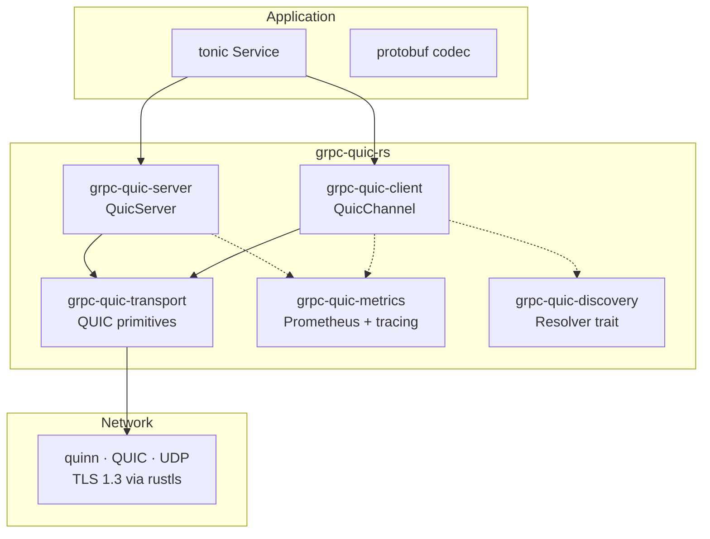

# grpc-quic-rs

> **Custom QUIC transport for tonic gRPC** — replaces HTTP/TCP with QUIC streams while preserving full gRPC semantics.

[](https://www.rust-lang.org)
[](#license)
[](https://docs.rs/grpc-quic)

---

## Motivation

Standard gRPC runs over HTTP/2 over TCP. While HTTP/2 solves head-of-line
blocking at the application layer, TCP still suffers from HOL blocking at the
transport layer. A single lost packet stalls all multiplexed streams.

**QUIC** (RFC 9000) eliminates TCP HOL blocking by giving each stream
independent loss recovery. Combined with TLS 1.3 built into the handshake,
QUIC offers:

- Lower connection establishment latency (0-RTT resumption)
- No transport-level HOL blocking across streams
- Connection migration (survives IP changes, e.g. mobile roaming)
- Built-in encryption — no separate TLS layer

`grpc-quic-rs` gives tonic services all of this with **zero changes to your
protobuf definitions or service implementations**.

---

## Architecture



### Key design principle

> **grpc-quic-rs does NOT modify gRPC semantics.**
> It only replaces the transport layer (TCP → QUIC).
> All gRPC payload bytes are forwarded verbatim — never interpreted or re-encoded.

### Crate structure

| Crate | Role |
|---|---|
| `grpc-quic` | Public façade — re-exports everything |
| `grpc-quic-transport` | Raw QUIC primitives (quinn + rustls). No tonic dependency. |
| `grpc-quic-client` | `QuicChannel` — tonic-compatible `tower::Service` |
| `grpc-quic-server` | `QuicServer` — accepts QUIC connections, delegates to tonic Router |
| `grpc-quic-metrics` | Prometheus counters + tracing spans |
| `grpc-quic-discovery` | `Resolver` trait + `StaticResolver` |

---

## Quick start

```rust
// Client
use grpc_quic::client::QuicChannel;

let channel = QuicChannel::builder()
    .connect("127.0.0.1:50051")
    .await?;

let mut client = MyServiceClient::new(channel);
let response = client.my_method(request).await?;
```

```rust
// Server
use grpc_quic::server::QuicServer;

QuicServer::builder()
    .tls(tls_config)
    .serve("0.0.0.0:50051".parse()?)
    .await?;
```

---

## Streaming support

All four gRPC streaming modes are supported:

| Mode | QUIC mapping |
|---|---|
| Unary | 1 bi-directional stream, half-closed after request |
| Client Streaming | 1 bi-directional stream, client writes N messages |
| Server Streaming | 1 bi-directional stream, server writes N messages |
| Bidirectional | 1 bi-directional stream, both sides write concurrently |

---

## Roadmap

- [x] **Phase 1** — Workspace scaffold, CI, justfile
- [x] **Phase 2** — QUIC transport: endpoints, connections, TLS
- [x] **Phase 3** — Server: QUIC acceptor → tonic Router dispatch
- [x] **Phase 4** — Client: QuicChannel + ConnectionPool + RetryPolicy
- [x] **Phase 5** — All streaming modes + examples
- [x] **Phase 6** — Prometheus metrics + tracing spans
- [x] **Phase 7** — Service discovery (Resolver trait + StaticResolver)
- [x] **Phase 8** — mdbook documentation + rustdoc
- [ ] **Phase 9** — Criterion benchmarks (vs tonic/TCP baseline)

---

## Development

```bash
# Install just (task runner)
cargo install just
# Install mdbook for docs
cargo install mdbook mdbook-mermaid

just build       # cargo build
just test        # cargo test
just check       # cargo check
just fmt         # cargo fmt
just lint        # cargo clippy -D warnings
just ci          # full CI pipeline locally
just docs-serve  # read the mdbook documentation
just doc         # open rustdoc API docs
```

---

## License

Licensed under either of:

- [MIT license](LICENSE-MIT)
- [Apache License, Version 2.0](LICENSE-APACHE)

at your option.
