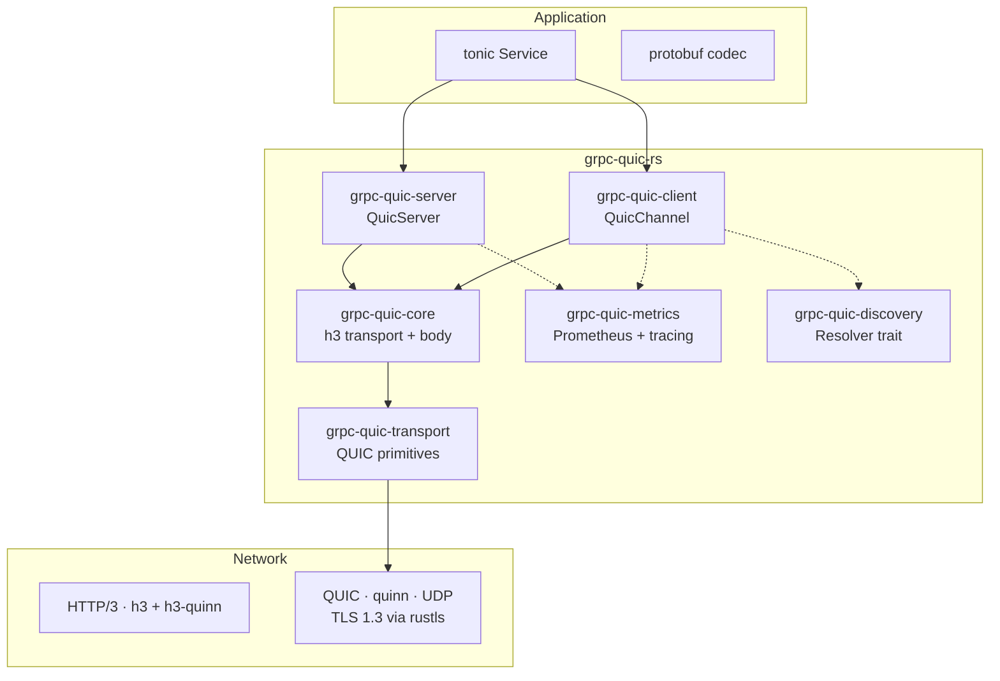

# Architecture

## Overview



## Protocol Stack

```
gRPC (protobuf codec + service traits)
  ↓
HTTP/3 (h3 v0.0.8 — pseudo-headers, data frames, trailers)
  ↓
QUIC (quinn v0.11 — bi-directional streams, TLS 1.3)
  ↓
UDP
```

## HTTP/3 Request Flow

### Client → Server

```
http::Request<BoxBody>
  → :method=POST
  → :path=/pkg.Service/Method
  → :authority=host:port
  → content-type: application/grpc
  → h3::client::send_request(req)
  → stream.send_data(body_chunks)
  → stream.finish()
```

### Server → Client

```
h3::server::accept() + resolve_request()
  → Request</()> з :method, :path, :authority
  → stream.split() → (SendStream, RecvStream)
  → RecvBody → tonic Request<BoxBody>
  → dispatch to tonic service
  → Response → send_response(headers)
  → send_data(body_chunks)
  → send_trailers(grpc-status, grpc-message)
```

## Streaming Modes

All four modes use the same HTTP/3 mechanism — no special handling:

| Mode | Request body | Response body |
|---|---|---|
| Unary | Single message | Single message + trailers |
| Client Streaming | N messages (data frames) | Single message + trailers |
| Server Streaming | Single message | N messages (data frames) + trailers |
| Bidirectional | N messages (interleaved) | N messages (interleaved) + trailers |

## Key crates

| Crate | Role |
|---|---|
| `grpc-quic-core` | h3 connection builders, `ServerRecvBody`/`ClientRecvBody` (http_body::Body on h3 streams), error types |
| `grpc-quic-client` | `H3ClientSession` pool, `QuicChannel` (tower::Service) |
| `grpc-quic-server` | h3 accept/resolve/dispatch, graceful shutdown |
