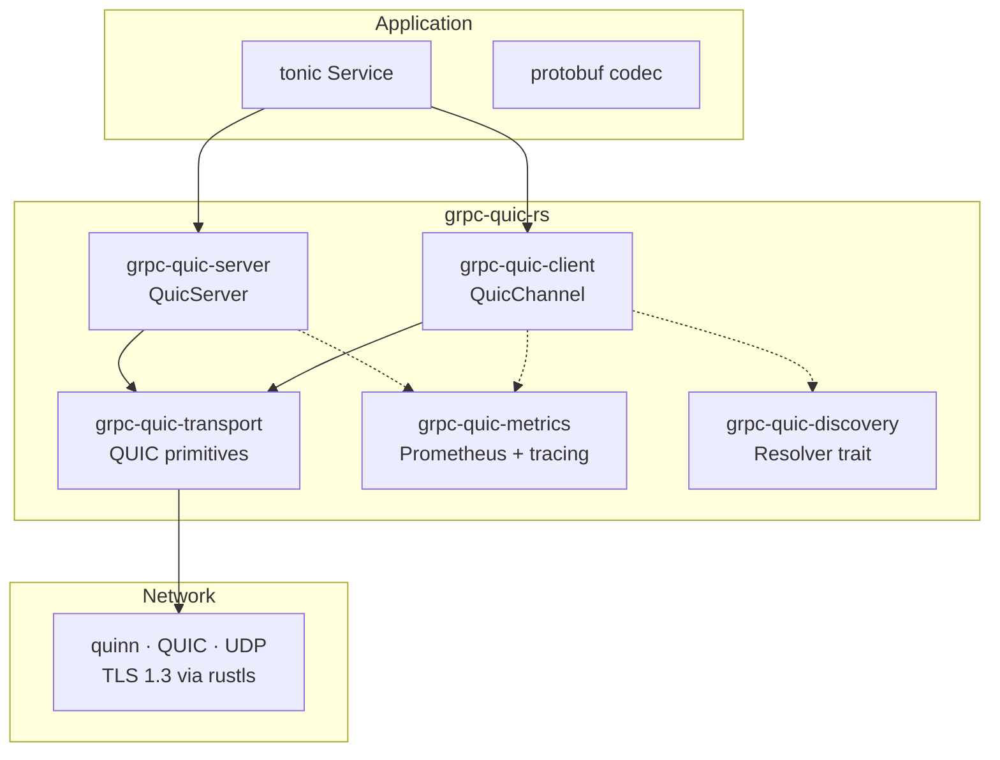

# Architecture

## Overview



## Wire Protocol

Each gRPC call maps to **one QUIC bi-directional stream**.

```
┌─ Request envelope (client → server) ──────────────────────┐
│  [u16 BE: path_len][path_bytes][gRPC payload from tonic…]  │
└────────────────────────────────────────────────────────────┘
┌─ Response envelope (server → client) ─────────────────────┐
│  [gRPC response payload from tonic…]                       │
│  [u32 BE: grpc_status][u16 BE: msg_len][msg_bytes]         │
└────────────────────────────────────────────────────────────┘
```

## Streaming Modes

| Mode | QUIC mapping |
|---|---|
| Unary | 1 bi-directional stream, half-closed after request |
| Client Streaming | 1 bi-directional stream, client writes N messages |
| Server Streaming | 1 bi-directional stream, server writes N messages |
| Bidirectional | 1 bi-directional stream, both sides write concurrently |

## Connection Lifecycle

1. **Client** creates a `QuicEndpoint::client()` bound to ephemeral port
2. **Client** calls `endpoint.connect(addr, server_name)` → QUIC handshake (TLS 1.3)
3. **Connection** stored in `ConnectionPool` for reuse
4. **Per RPC call**: `conn.open_bi()` → write path header + gRPC payload → half-close
5. **Server** accepts via `endpoint.accept()` → spawns per-connection handler
6. **Per stream**: reads path header → dispatches to tonic service → streams response
7. **Server** writes trailer status (grpc-status, grpc-message) → half-close
